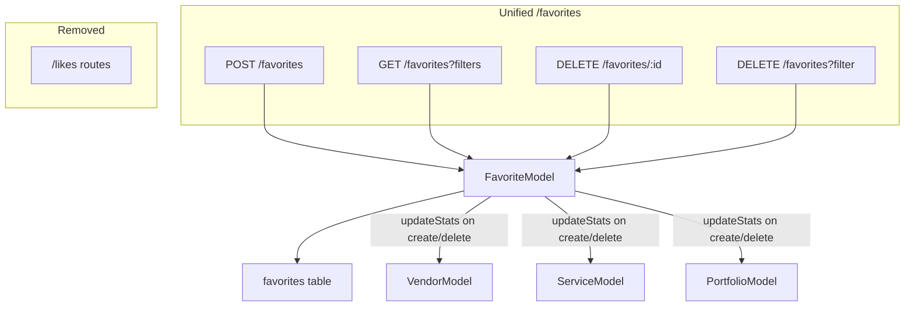

# Unified Favorites Endpoint

## Architecture

Replace the separate `/favorites` (vendor) and `/likes` (service) routes with a single unified `/favorites` RESTful resource. Add portfolio as a third target type.




## API Design

All endpoints require authentication.

### POST /favorites

Create a favorite. Returns 201 if new, 200 if already exists.

**Body:** `{ targetId: string, targetType: "vendor" | "service" | "portfolio", sourceId?: string, sourceType?: string }`

`sourceId` defaults to authenticated user ID; `sourceType` defaults to `"user"`.

### GET /favorites

Query favorites with combinable filter params.

**Query params:**

- `sourceId` (defaults to authenticated user ID if not provided)
- `sourceType`, `targetId`, `targetType`
- `limit` (default 100), `offset` (default 0)
- `resolve` (optional, `"true"` to enrich each record with the full target entity)

**Response without resolve:**

```json
[{ "id": "fav-uuid", "sourceId": "...", "sourceType": "user", "targetId": "...", "targetType": "vendor", "createdAt": "...", "updatedAt": "..." }]
```

**Response with `resolve=true`:**

```json
[{ "id": "fav-uuid", "sourceId": "...", "targetId": "...", "targetType": "vendor", "target": { /* full Vendor/Service/Portfolio object */ }, "createdAt": "...", "updatedAt": "..." }]
```

Records where the target entity no longer exists or is not `active` are filtered out when `resolve=true`.

### DELETE /favorites/:id

Delete a single favorite by primary key. Returns 204 on success, 404 if not found. Triggers `updateStats` on the target.

### DELETE /favorites (bulk)

Delete favorites matching exactly **one** query filter param. Returns `{ deleted: number }`.

**Allowed params (one at a time):** `sourceId`, `targetId`, `sourceType`, `targetType`

Returns 400 if zero or more than one filter param is provided.

---

## Backend Changes

### 1. Migration 029: Add `favoriteCount` to portfolios

Create [platform-backend/src/database/migrations/029_add_portfolio_favorite_count.sql](platform-backend/src/database/migrations/029_add_portfolio_favorite_count.sql).

### 2. Backend types

In [platform-backend/src/types/service.types.ts](platform-backend/src/types/service.types.ts), add `favoriteCount: number` to `Portfolio` interface.

### 3. FavoriteModel extensions

In [platform-backend/src/models/engagement/Favorite.ts](platform-backend/src/models/engagement/Favorite.ts):

- `FavoriteTargetType`: `'vendor' | 'service' | 'portfolio'`
- `findByUserAndPortfolio(userId, portfolioId)`: convenience method
- `findById(id)`: fetch single favorite by PK (needed for DELETE /:id)
- `findFiltered(filters)`: unified query builder for GET with optional `sourceId`, `sourceType`, `targetId`, `targetType`, `limit`, `offset`
- `deleteById(id)`: delete by PK, return the deleted row (so the route can trigger updateStats based on targetType)
- `deleteByFilter(key, value)`: bulk delete by single column filter, return deleted count
- In `create()` / `delete()`: add `else if (targetType === 'portfolio') await PortfolioModel.updateStats(targetId)`
- Import `PortfolioModel`

### 4. PortfolioModel.updateStats

In [platform-backend/src/models/marketplace/Portfolio.ts](platform-backend/src/models/marketplace/Portfolio.ts), add:

```typescript
static async updateStats(id: string): Promise<void> {
  const pool = await PortfolioModel.getPool();
  await pool.query(
    `UPDATE portfolios SET "favoriteCount" = (
      SELECT COUNT(*) FROM favorites
      WHERE "targetId" = portfolios.id AND "targetType" = 'portfolio'
    ) WHERE id = $1`,
    [id]
  );
}
```

### 5. Rewrite favorites.ts

Rewrite [platform-backend/src/routes/v1/favorites.ts](platform-backend/src/routes/v1/favorites.ts):

- **POST `/**` -- Read body, default `sourceId`/`sourceType`, check existence via `findBySourceAndTarget`, create if new. Return favorite record.
- **GET `/**` -- Parse query filters, default `sourceId` to `req.user.id`. Call `findFiltered()`. If `resolve=true`, for each record resolve the entity via `VendorModel.findById` / `ServiceModel.findById` / `PortfolioModel.findById` based on `targetType`, filter out inactive/missing, attach as `target` field.
- **DELETE `/:id**` -- `findById(id)`, validate ownership (`sourceId === req.user.id`), delete, trigger `updateStats`, return 204.
- **DELETE `/**` -- Validate exactly one filter param, call `deleteByFilter`, return `{ deleted }`.
- Import `VendorModel`, `ServiceModel`, `PortfolioModel` for resolve.

### 6. Remove likes.ts

- Delete [platform-backend/src/routes/v1/likes.ts](platform-backend/src/routes/v1/likes.ts)
- In [platform-backend/src/routes/v1/index.ts](platform-backend/src/routes/v1/index.ts): remove `import likeRoutes` and `router.use('/likes', likeRoutes)`

---

## Frontend Changes (platform-app)

### 7. use-vendor-favorite.ts

[platform-app/hooks/use-vendor-favorite.ts](platform-app/hooks/use-vendor-favorite.ts):

- **Check**: `GET /favorites?targetId=${vendorId}&targetType=vendor` -- if array has length > 0, it's favorited. Store the `favorite.id` for later DELETE.
- **Add**: `POST /favorites` with body `{ targetId: vendorId, targetType: 'vendor' }`. Store returned `favorite.id`.
- **Remove**: `DELETE /favorites/${favoriteId}` using the stored favorite record ID.

### 8. use-user-favorites.ts

[platform-app/hooks/use-user-favorites.ts](platform-app/hooks/use-user-favorites.ts):

- Change `GET /favorites` to `GET /favorites?targetType=vendor&resolve=true`
- Response is now `[{ ...favorite, target: Vendor }]` -- extract the `target` field to get `Vendor[]`

### 9. use-user-likes.ts

[platform-app/hooks/use-user-likes.ts](platform-app/hooks/use-user-likes.ts):

- Change `GET /likes` to `GET /favorites?targetType=service&resolve=true`
- Response is now `[{ ...favorite, target: Service }]` -- extract `target` to get `Service[]`

### 10. user-likes-context.tsx

[platform-app/contexts/user-likes-context.tsx](platform-app/contexts/user-likes-context.tsx) -- the most involved change:

- **Fetch**: `GET /favorites?targetType=service&resolve=true` -- store both the services AND a `Map<serviceId, favoriteId>` for DELETE operations.
- **toggleLike (add)**: `POST /favorites` with `{ targetId: serviceId, targetType: 'service' }`. Store the returned `favorite.id` in the map.
- **toggleLike (remove)**: Look up `favoriteId` from the map, call `DELETE /favorites/${favoriteId}`.
- Optimistic update logic stays the same (optimisticAdded/optimisticRemoved sets), just the API calls change.

### 11. Frontend types

In [platform-app/types/index.ts](platform-app/types/index.ts), add `favoriteCount: number` to `Portfolio` interface.

### 12. Update skill

Update [SKILL.md](.cursor/skills/platform-schema-map/SKILL.md) and [schema-reference.md](.cursor/skills/platform-schema-map/schema-reference.md) with `favoriteCount` column on portfolios.
